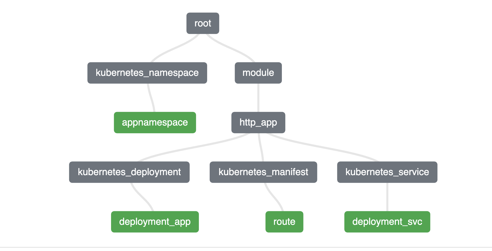

# Crear aplicaciones http

Se crea una aplicación HTTP con el provider de Kubernetes, el cual puede administrar recursos del API de Kubernetes (CR) para crear recursos como Rutas, DeploymentConfigs u operadores es necesario utilizar el modulo de (CRD) manualmente.

En este ejercicio se crea un modulo para automatizar la creación de aplicaciones httpd.

## Configuración de la versión del provider

Se define el provider de kubernetes `versions.tf`

## Añadir autenticación

Agregar dirección del API y token en el archivo `variables.tf` estos definen la autenticación en el archivo `provider.tf`

## Ejecutar terraform init

Se ejecuta el comando terraform init para inicializar el proyecto y los modulos.

terraform init

~~~ bash

terraform init

Initializing the backend...
Initializing modules...
- http_app in modules/http_app

Initializing provider plugins...
- Finding hashicorp/kubernetes versions matching ">= 2.0.0"...
- Installing hashicorp/kubernetes v2.28.1...
- Installed hashicorp/kubernetes v2.28.1 (signed by HashiCorp)

~~~

## Visualizar terraform plan
[https://github.com/hieven/terraform-visual?tab=readme-ov-file](https://github.com/hieven/terraform-visual?tab=readme-ov-file)
~~~ bash

terraform plan -out=plan.out
terraform show -json plan.out > plan.json
terraform-visual --plan plan.json
~~~

## Aplicar terraform

~~~ bash
terraform apply

Plan: 4 to add, 0 to change, 0 to destroy.

Do you want to perform these actions?
  Terraform will perform the actions described above.
  Only 'yes' will be accepted to approve.

  Enter a value: yes

kubernetes_namespace.appnamespace: Creating...
module.http_app.kubernetes_deployment.deployment_app: Creating...
kubernetes_namespace.appnamespace: Creation complete after 0s [id=terraforms]
module.http_app.kubernetes_deployment.deployment_app: Creation complete after 8s [id=terraforms/httpdxpk]
module.http_app.kubernetes_service.deployment_svc: Creating...
module.http_app.kubernetes_service.deployment_svc: Creation complete after 0s [id=terraforms/httpdxpk]
module.http_app.kubernetes_manifest.route: Creating...
module.http_app.kubernetes_manifest.route: Creation complete after 1s

Apply complete! Resources: 4 added, 0 changed, 0 destroyed.
~~~

## Validar

~~~ bash
oc get route -n terraforms

NAME       HOST/PORT                                                           PATH   SERVICES   PORT        TERMINATION   WILDCARD
httpdxpk   httpdxpk-terraforms.apps.cluster-name.io          httpdxpk   http-port   edge          None

~~~